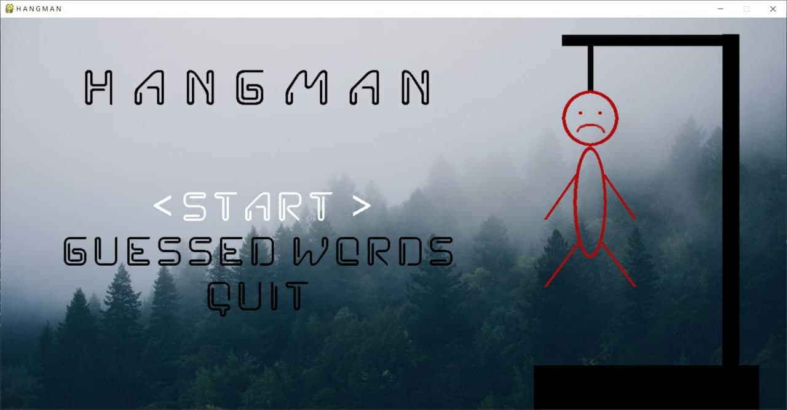
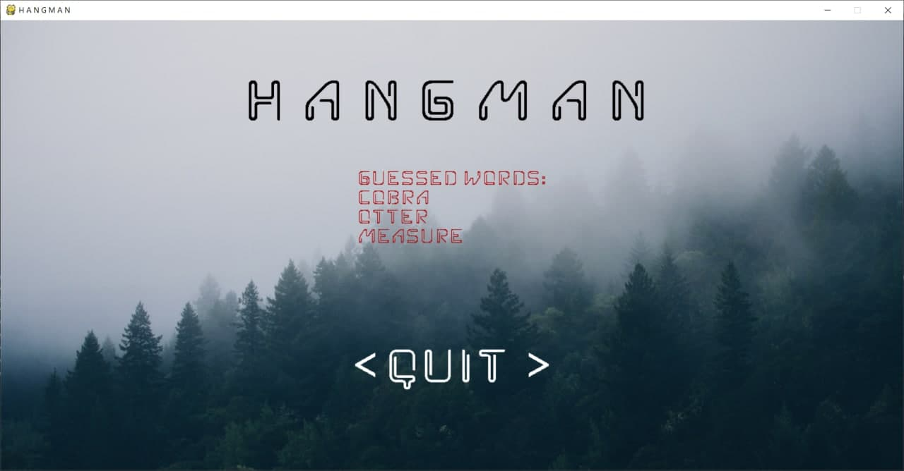
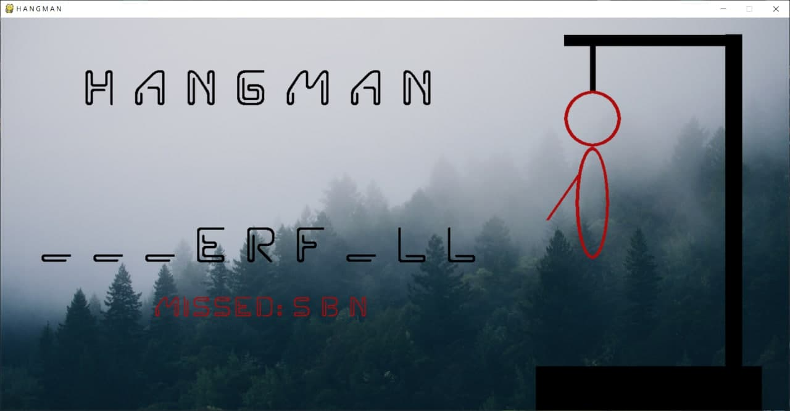

Данный проект - реализация игры виселица.
Загадывается слово, в соответствии с количеством букв рисуются черточки. Также рисуется виселица с петлёй.
Игрок предлагает букву, которая может входить в загаданное слово. 
Если такая буква есть в слове, то она вписывается в соответствующее место столько раз, сколько она встречается в слове. 
Если такой буквы нет, то к виселице добавляется круг в петле, изображающий голову. 
Попытки отгадать буквы продолжаются до тех пор, пока не будет отгадано всё слово. 
За каждый неправильный ответ добавляется одна часть туловища человечка (их 6: голова, туловище, 2 руки и 2 ноги)
Если туловище в виселице нарисовано полностью, то игрок проигрывает.
Если игроку удаётся угадать слово, он выигрывает.

1. Для начала установите все зависимости с файла requirements.txt с помощью команды pip -r requirements.txt
в папке игры hangman;
2. Затем запустите модуль main.py;
3. Откроется окно главного меню, что имеет такой вид:

Навигация осуществляется с помощью стрелочек вверх и вниз, выбор пункта меню осуществляется с помощью нажатия на ENTER.
3.1. При выборе пункта меню < QUIT > приложение закроется;
3.2. При выборе пункта меню < GUESSED WORDS > откроется форма, что имеет вид:

На данной форме отображаются все угаданные Вами слова (если Вы еще не выигрывали, список угаданных слов будет пуст).
Дабы выйти из данной формы и возвратиться в главное меню, стоит нажать ENTER.
3.3. При выборе пункта меню < START > начнется игра и откроется такого вида форма:

Если Вы захотите вернуться на главное меню, нажмите ESCAPE, в таком случае игра завершиться.
Если же Вы решили сыграть, тогда Вам следует попробовать угадать загаданное слово посредством нажатия на предполагаемую 
букву, что может содержаться в загаданном слове.
Стоит нажимать лишь на клавиши букв английского алфавита, в ином случае ничего не произойдет, так же как и в случае 
повторного нажатия на букву, такое действие будет проигнорировано.
Если нажатая Вами буква содержится в загаданном слове, она будет отображена в соответствующем месте данного слова.
Если же буквы в слове нет, она запишется в список после слова MISSED: внизу формы, и в соответствии с тем, 
какой это промах по счету, будет рисоваться человечек на висельнице справа.
Игра завершится, 1) если слово будет угадано (Вы выиграли), 2) если вы исчерпали 6 промахов, и человечек отрисован 
полностью (Вы проиграли).